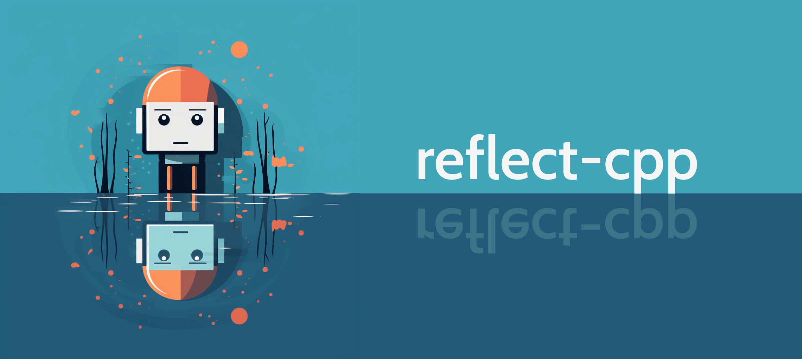

#  reflect-cpp

[](https://opensource.org/licenses/MIT)
[](https://GitHub.com/Naereen/StrapDown.js/graphs/commit-activity)
[](https://shields.io/)
[](https://shields.io/)
[](https://shields.io/)
[](https://shields.io/)



**reflect-cpp** is a C++-20 library for **fast serialization, deserialization and validation** using reflection, similar to [pydantic](https://github.com/pydantic/pydantic) in Python, [serde](https://github.com/serde-rs) in Rust, [encoding](https://github.com/golang/go/tree/master/src/encoding) in Go or [aeson](https://github.com/haskell/aeson/tree/master) in Haskell.

As the aforementioned libraries are among the most widely used in the respective languages, reflect-cpp fills an important gap in C++ development. It reduces boilerplate code and increases code safety.

Design principles for reflect-cpp include:

- Close integration with containers from the C++ standard library
- Close adherence to C++ idioms
- Out-of-the-box support for JSON
- Simple installation: If no JSON support is required, reflect-cpp is header-only. For JSON support, only a single source file needs to be compiled.
- Simple extendability to other serialization formats
- Simple extendability to custom classes

## Serialization formats

reflect-cpp provides a unified reflection-based interface across different serialization formats. It is deliberately designed in a very modular way, using [concepts](https://en.cppreference.com/w/cpp/language/constraints), to make it as easy as possible to interface various C or C++ libraries related to serialization. Refer to the [documentation](https://github.com/getml/reflect-cpp/tree/main/docs) for details.

The following table lists the serialization formats currently supported by reflect-cpp and the underlying libraries used:

| Format       | Library                                              | Version      | License    | Remarks                                              |
|--------------|------------------------------------------------------|--------------|------------| -----------------------------------------------------|
| JSON         | [yyjson](https://github.com/ibireme/yyjson)          | >= 0.8.0     | MIT        | out-of-the-box support, included in this repository  |
| BSON         | [libbson](https://github.com/mongodb/libbson)        | >= 1.25.1    | Apache 2.0 | JSON-like binary format                              |
| CBOR         | [tinycbor](https://github.com/intel/tinycbor)        | >= 0.6.0     | MIT        | JSON-like binary format                              |
| flexbuffers  | [flatbuffers](https://github.com/google/flatbuffers) | >= 23.5.26   | Apache 2.0 | Schema-less version of flatbuffers, binary format    |
| msgpack      | [msgpack-c](https://github.com/msgpack/msgpack-c)    | >= 6.0.0     | BSL 1.0    | JSON-like binary format                              |
| TOML         | [toml++](https://github.com/marzer/tomlplusplus)     | >= 3.4.0     | MIT        | Textual format with an emphasis on readability       |
| XML          | [pugixml](https://github.com/zeux/pugixml)           | >= 1.14      | MIT        | Textual format used in many legacy projects          |
| YAML         | [yaml-cpp](https://github.com/jbeder/yaml-cpp)       | >= 0.8.0     | MIT        | Textual format with an emphasis on readability       |

Support for more serialization formats is in development. Refer to the [issues](https://github.com/getml/reflect-cpp/issues) for details.

Please also refer to the *vcpkg.json* in this repository.

## Simple Example

```cpp
#include <rfl/json.hpp>
#include <rfl.hpp>

struct Person {
  std::string first_name;
  std::string last_name;
  int age;
};

const auto homer =
    Person{.first_name = "Homer",
           .last_name = "Simpson",
           .age = 45};

// We can now write into and read from a JSON string.
const std::string json_string = rfl::json::write(homer);
auto homer2 = rfl::json::read<Person>(json_string).value();
```

The resulting JSON string looks like this:

```json
{"first_name":"Homer","last_name":"Simpson","age":45}
```

You can transform the field names from `snake_case` to `camelCase` like this:

```cpp
const std::string json_string = 
  rfl::json::write<rfl::SnakeCaseToCamelCase>(homer);
auto homer2 = 
  rfl::json::read<Person, rfl::SnakeCaseToCamelCase>(json_string).value();
```

The resulting JSON string looks like this:

```json
{"firstName":"Homer","lastName":"Simpson","age":45}
```

Or you can use another format, such as YAML.

```cpp
#include <rfl/yaml.hpp>

// ... (same as above)

const std::string yaml_string = rfl::yaml::write(homer);
auto homer2 = rfl::yaml::read<Person>(yaml_string).value();
```

The resulting YAML string looks like this:

```yaml
first_name: Homer
last_name: Simpson
age: 45
```

This will work for just about any example in the entire documentation 
and any supported format, except where explicitly noted otherwise:

```cpp
rfl::bson::write(homer);
rfl::cbor::write(homer);
rfl::flexbuf::write(homer);
rfl::msgpack::write(homer);
rfl::toml::write(homer);
rfl::xml::write(homer);

rfl::bson::read<Person>(bson_bytes);
rfl::cbor::read<Person>(cbor_bytes);
rfl::flexbuf::read<Person>(flexbuf_bytes);
rfl::msgpack::read<Person>(msgpack_bytes);
rfl::toml::read<Person>(toml_string);
rfl::xml::read<Person>(xml_string);
```

## More Comprehensive Example

```cpp
#include <iostream>
#include <rfl/json.hpp>
#include <rfl.hpp>

// Age must be a plausible number, between 0 and 130. This will
// be validated automatically.
using Age = rfl::Validator<int, rfl::Minimum<0>, rfl::Maximum<130>>;

struct Person {
  rfl::Rename<"firstName", std::string> first_name;
  rfl::Rename<"lastName", std::string> last_name = "Simpson";
  std::string town = "Springfield";
  rfl::Timestamp<"%Y-%m-%d"> birthday;
  Age age;
  rfl::Email email;
  std::vector<Person> children;
};

const auto bart = Person{.first_name = "Bart",
                         .birthday = "1987-04-19",
                         .age = 10,
                         .email = "bart@simpson.com"};

const auto lisa = Person{.first_name = "Lisa",
                         .birthday = "1987-04-19",
                         .age = 8,
                         .email = "lisa@simpson.com"};

const auto maggie = Person{.first_name = "Maggie",
                           .birthday = "1987-04-19",
                           .age = 0,
                           .email = "maggie@simpson.com"};

const auto homer =
    Person{.first_name = "Homer",
           .birthday = "1987-04-19",
           .age = 45,
           .email = "homer@simpson.com",
           .children = std::vector<Person>({bart, lisa, maggie})};

// We can now transform this into a JSON string.
const std::string json_string = rfl::json::write(homer);
std::cout << json_string << std::endl;

// We can also directly write into std::cout (or any other std::ostream).
rfl::json::write(homer, std::cout) << std::endl;
```

This results in the following JSON string:

```json
{"firstName":"Homer","lastName":"Simpson","town":"Springfield","birthday":"1987-04-19","age":45,"email":"homer@simpson.com","children":[{"firstName":"Bart","lastName":"Simpson","town":"Springfield","birthday":"1987-04-19","age":10,"email":"bart@simpson.com","children":[]},{"firstName":"Lisa","lastName":"Simpson","town":"Springfield","birthday":"1987-04-19","age":8,"email":"lisa@simpson.com","children":[]},{"firstName":"Maggie","lastName":"Simpson","town":"Springfield","birthday":"1987-04-19","age":0,"email":"maggie@simpson.com","children":[]}]}
```

We can also create structs from the string:

```cpp
auto homer2 = rfl::json::read<Person>(json_string).value();

// Fields can be accessed like this:
std::cout << "Hello, my name is " << homer.first_name() << " "
          << homer.last_name() << "." << std::endl;

// Since homer2 is mutable, we can also change the values like this:
homer2.first_name = "Marge";

std::cout << "Hello, my name is " << homer2.first_name() << " "
          << homer2.last_name() << "." << std::endl;
```

## Error messages

reflect-cpp returns clear and comprehensive error messages:

```cpp
const std::string faulty_json_string =
    R"({"firstName":"Homer","lastName":12345,"town":"Springfield","birthday":"04/19/1987","age":145,"email":"homer(at)simpson.com"})";
const auto result = rfl::json::read<Person>(faulty_json_string);
```

Yields the following error message:

```
Found 5 errors:
1) Failed to parse field 'lastName': Could not cast to string.
2) Failed to parse field 'birthday': String '04/19/1987' did not match format '%Y-%m-%d'.
3) Failed to parse field 'age': Value expected to be less than or equal to 130, but got 145.
4) Failed to parse field 'email': String 'homer(at)simpson.com' did not match format 'Email': '^[a-zA-Z0-9._%+-]+@[a-zA-Z0-9.-]+\.[a-zA-Z]{2,}$'.
5) Field named 'children' not found.
```

## JSON schema

reflect-cpp also supports generating JSON schemata:

```cpp
struct Person {
  std::string first_name;
  std::string last_name;
  rfl::Description<"Must be a proper email in the form xxx@xxx.xxx.",
                   rfl::Email>
      email;
  rfl::Description<
      "The person's children. Pass an empty array for no children.",
      std::vector<Person>>
      children;
  float salary;
};

const std::string json_schema = rfl::json::to_schema<Person>();
```

The resulting JSON schema looks like this:

```json
{"$schema":"https://json-schema.org/draft/2020-12/schema","$ref":"#/definitions/Person","definitions":{"Person":{"type":"object","properties":{"children":{"type":"array","description":"The person's children. Pass an empty array for no children.","items":{"$ref":"#/definitions/Person"}},"email":{"type":"string","description":"Must be a proper email in the form xxx@xxx.xxx.","pattern":"^[a-zA-Z0-9._%+\\-]+@[a-zA-Z0-9.\\-]+\\.[a-zA-Z]{2,}$"},"first_name":{"type":"string"},"last_name":{"type":"string"},"salary":{"type":"number"}},"required":["children","email","first_name","last_name","salary"]}}}
```

Note that this is currently supported for JSON only, since most other formats do not support schemata in the first place.

## Enums

reflect-cpp supports scoped enumerations:

```cpp
enum class Shape { circle, square, rectangle };

enum class Color { red = 256, green = 512, blue = 1024, yellow = 2048 };

struct Item {
  float pos_x;
  float pos_y;
  Shape shape;
  Color color;
};

const auto item = Item{.pos_x = 2.0,  
                       .pos_y = 3.0,
                       .shape = Shape::square,
                       .color = Color::red | Color::blue};

rfl::json::write(item);
```

This results in the following JSON string:

```json
{"pos_x":2.0,"pos_y":3.0,"shape":"square","color":"red|blue"}
```

You can also directly convert between enumerator values and strings with `rfl::enum_to_string()` and `rfl::string_to_enum()`, or
obtain list of enumerator name and value pairs with `rfl::get_enumerators<EnumType>()` or `rfl::get_enumerator_array<EnumType>()`.

## Algebraic data types

reflect-cpp supports Pydantic-style tagged unions, which allow you to form algebraic data types:

```cpp
struct Circle {
    double radius;
};

struct Rectangle {
    double height;
    double width;
};

struct Square {
    double width;
};

using Shapes = rfl::TaggedUnion<"shape", Circle, Square, Rectangle>;

const Shapes r = Rectangle{.height = 10, .width = 5};

const auto json_string = rfl::json::write(r);
```

This results in the following JSON string:

```json
{"shape":"Rectangle","height":10.0,"width":5.0}
```

Other forms of tagging are supported as well. Refer to the [documentation](https://github.com/getml/reflect-cpp/tree/main/docs) for details.

## Reflective programming

Beyond serialization and deserialization, reflect-cpp also supports reflective programming in general.

For instance:

```cpp
struct Person {
  std::string first_name;
  std::string last_name = "Simpson";
  std::string town = "Springfield";
  unsigned int age;
  std::vector<Person> children;
};

for (const auto& f : rfl::fields<Person>()) {
  std::cout << "name: " << f.name() << ", type: " << f.type() << std::endl;
}
```

You can also create a view and then access these fields using `std::get` or `rfl::get`, or iterate over the fields at compile-time:

```cpp
auto lisa = Person{.first_name = "Lisa", .last_name = "Simpson", .age = 8};

const auto view = rfl::to_view(lisa);

// view.values() is a std::tuple containing
// pointers to the original fields.
// This will modify the struct `lisa`:
*std::get<0>(view.values()) = "Maggie";

// All of this is supported as well:
*view.get<1>() = "Simpson";
*view.get<"age">() = 0;
*rfl::get<0>(view) = "Maggie";
*rfl::get<"first_name">(view) = "Maggie";

view.apply([](const auto& f) {
  // f is a an rfl::Field pointing to the original field.
  std::cout << f.name() << ": " << rfl::json::write(*f.value()) << std::endl;
});
```

It also possible to replace fields:

```cpp
struct Person {
  std::string first_name;
  std::string last_name;
  std::vector<Person> children;
};

const auto lisa = Person{.first_name = "Lisa", .last_name = "Simpson"};

// Returns a deep copy of "lisa" with the first_name replaced.
const auto maggie = rfl::replace(
    lisa, rfl::make_field<"first_name">(std::string("Maggie")));
```

Or you can create structs from other structs:

```cpp
struct A {
  std::string f1;
  std::string f2;
};

struct B {
  std::string f3;
  std::string f4;
};

struct C {
  std::string f1;
  std::string f2;
  std::string f4;
};

const auto a = A{.f1 = "Hello", .f2 = "World"};

const auto b = B{.f3 = "Hello", .f4 = "World"};

// f1 and f2 are taken from a, f4 is taken from b, f3 is ignored.
const auto c = rfl::as<C>(a, b);
```

You can also replace fields in structs using fields from other structs:

```cpp
const auto a = A{.f1 = "Hello", .f2 = "World"};

const auto c = C{.f1 = "C++", .f2 = "is", .f4 = "great"};

// The fields f1 and f2 are replaced with the fields f1 and f2 in a.
const auto c2 = rfl::replace(c, a);
```


## Support for containers

### C++ standard library

reflect-cpp supports the following containers from the C++ standard library:

- `std::array`
- `std::deque`
- `std::forward_list`
- `std::map`
- `std::multimap`
- `std::multiset`
- `std::list`
- `std::optional`
- `std::pair`
- `std::set`
- `std::shared_ptr`
- `std::string`
- `std::tuple`
- `std::unique_ptr`
- `std::unordered_map`
- `std::unordered_multimap`
- `std::unordered_multiset`
- `std::unordered_set`
- `std::variant`
- `std::vector`
- `std::wstring`

### Additional containers

In addition, it supports the following custom containers:

- `rfl::Box`: Similar to `std::unique_ptr`, but (almost) guaranteed to never be null.
- `rfl::Literal`: An explicitly enumerated string.
- `rfl::NamedTuple`: Similar to `std::tuple`, but with named fields that can be retrieved via their name at compile time.
- `rfl::Ref`: Similar to `std::shared_ptr`, but (almost) guaranteed to never be null.
- `rfl::Result`: Allows for exception-free programming.
- `rfl::TaggedUnion`: Similar to `std::variant`, but with explicit tags that make parsing more efficient.
- `rfl::Validator`: Allows for automatic input validation.
- `rfl::Variant`: An alternative to `std::variant`.

### Custom classes

Finally, it is very easy to extend full support to your own classes, refer to the [documentation](https://github.com/getml/reflect-cpp/tree/main/docs) for details.

## Why do we need this?

Suppose your C++ program has complex data structures it needs to save and load. Or maybe it needs to interact with some kind of external API. If you do this the traditional way, you will have a lot of boilerplate code. This is annoying and error-prone.

reflect-cpp is not just a reflection library, it is for **serialization, deserialization and validation** through reflection.

That means that you can encode your requirements about the input data in the type system and have them validated upfront. This is why the library also includes algebraic data types like tagged unions and numerous validation routines. Having your requirements encoded in the type system is the most reliable way of ensuring they are met. If your requirements are not met, the user of your software gets a very clear error message. Encoding your requirements in the type system also makes it a lot easier for anyone reading your code.

This increases user experience and developer experience, it makes your code safer (fewer bugs) and more secure (less prone to malicious attacks).

For a more in-depth theoretical discussions of these topics, the following books are warmly recommended:

- *Category Theory for Programmers* by Bartosz Milewski (https://github.com/hmemcpy/milewski-ctfp-pdf/releases)
- *Domain Modeling Made Functional* by Scott Wlaschin

## Documentation

Click [here](https://github.com/getml/reflect-cpp/tree/main/docs).

## Benchmarks

reflect-cpp conducts continuuous benchmarking across different operating systems, compilers and architectures
and publishes the results on its [Actions tab](https://github.com/getml/reflect-cpp/actions).
Refer to the [benchmarks folder](https://github.com/getml/reflect-cpp/tree/main/benchmarks) for details.

The benchmarks show that reflect-cpp is not only very convenient, but also one the fastest JSON libraries for C++.
It is faster than RapidJSON and about 10 times faster than nlohmann/json. It can be even faster than that, 
if you choose to use a different format supported by reflect-cpp, such as msgpack.

## Installation

The following compilers are supported:
- GCC 11.4 or higher
- Clang 16.0 or higher
- MSVC 17.8 (19.38) or higher

### Option 1: Header-only

If you **do not** need JSON support or you want to link YYJSON yourself, then reflect-cpp is header-only. Simply copy the contents of the folder `include` into your source repository or add it to your include path.

### Option 2: Include source files into your own build

Simply copy the contents of the folder `include` into your source repository or add it to your include path and also add `src/yyjson.c` to your source files for compilation.

If you need support for other serialization formats like flexbuffers or XML, you should also include and link the respective libraries, as listed in the section on serialization formats.

### Option 3: Compilation using cmake

This will simply compile YYJSON, which is the JSON library underlying reflect-cpp. You can then include reflect-cpp in your project and link to the binary
to get reflect-cpp with JSON support.

```bash
cmake -S . -B build -DCMAKE_BUILD_TYPE=Release
cmake --build build -j 4  # gcc, clang
cmake --build build --config Release -j 4  # MSVC
```

### Option 4: Compilation using cmake and vcpkg

If you want serialization formats other than JSON, you can either install them manually or use vcpkg.

To install vcpkg:

```bash
git submodule update --init
./vcpkg/bootstrap-vcpkg.sh # Linux, macOS
./vcpkg/bootstrap-vcpkg.bat # Windows
# You may be prompted to install additional dependencies.
```

To use reflect-cpp in your project:

```cmake
add_subdirectory(reflect-cpp) # Add this project as a subdirectory

set(REFLECTCPP_BSON ON) # Optional
set(REFLECTCPP_CBOR ON) # Optional
set(REFLECTCPP_FLEXBUFFERS ON) # Optional
set(REFLECTCPP_MSGPACK ON) # Optional
set(REFLECTCPP_TOML ON) # Optional
set(REFLECTCPP_XML ON) # Optional
set(REFLECTCPP_YAML ON) # Optional

target_link_libraries(your_project PRIVATE reflectcpp) # Link against the library
```

## Troubleshooting vcpkg

vcpkg is a great, but very ambitious and complex project (just like C++ is a great, but very ambitious and complex language). Here are some of the you might run into and how to resolve them:

1. A lot of problems can simply be resolved by deleting the build directory using `rm -rf build`.

2. *Environment variable VCPKG_FORCE_SYSTEM_BINARIES must be set on arm, s390x, ppc64le and riscv platforms.* - This usually happens on arm platforms like the Apple Silicon chips and can be resolved by simply preceding your build with `export VCPKG_FORCE_SYSTEM_BINARIES=arm` or `export VCPKG_FORCE_SYSTEM_BINARIES=1`.

3. On some occasions you might be asked to specify a compiler. You can do so by simply adding it to the cmake command as follows: `cmake -S . -B build ... -DCMAKE_C_COMPILER=gcc -DCMAKE_CXX_COMPILER=g++` or `cmake -S . -B build ... -DCMAKE_C_COMPILER=clang-17 -DCMAKE_CXX_COMPILER=clang++-17` (or whatever supported compiler you would like to use).

## Compiling and running the tests

reflect-cpp uses vcpkg for dependency management, including
gtest, which is required for the tests.

```bash
# bootstrap vcpkg if you haven't done so already 
git submodule update --init
./vcpkg/bootstrap-vcpkg.sh # Linux, macOS
./vcpkg/bootstrap-vcpkg.bat # Windows
# You may be prompted to install additional dependencies.
```

### JSON only

To compile the tests, do the following:

```bash
cmake -S . -B build -DCMAKE_BUILD_TYPE=Release -DREFLECTCPP_BUILD_TESTS=ON
cmake --build build -j 4 # gcc, clang
cmake --build build --config Release -j 4 # MSVC
```

To run the tests, do the following:

```
./build/tests/json/reflect-cpp-json-tests
```

### All serialization formats

To compile the tests with serialization formats other than JSON, do the following:

```bash
cmake -S . -B build -DREFLECTCPP_BUILD_TESTS=ON -DREFLECTCPP_BSON=ON -DREFLECTCPP_CBOR=ON -DREFLECTCPP_FLEXBUFFERS=ON -DREFLECTCPP_MSGPACK=ON -DREFLECTCPP_XML=ON -DREFLECTCPP_TOML=ON -DREFLECTCPP_YAML=ON -DCMAKE_BUILD_TYPE=Release
cmake --build build -j 4 # gcc, clang
cmake --build build --config Release -j 4 # MSVC
```

To run the tests, do the following:

```
./build/tests/bson/reflect-cpp-bson-tests
./build/tests/cbor/reflect-cpp-cbor-tests
./build/tests/flexbuffers/reflect-cpp-flexbuffers-tests
./build/tests/msgpack/reflect-cpp-msgpack-tests
./build/tests/json/reflect-cpp-json-tests
./build/tests/toml/reflect-cpp-toml-tests
./build/tests/xml/reflect-cpp-xml-tests
./build/tests/yaml/reflect-cpp-yaml-tests
```

## How to contribute

### Make sure includes are relative

In order for the library to be able to function header-only, we need internal includes to be relative and not depend on any externally set include directory.

That is, for example, if you are within any file in `rfl/internal`, prefer
```cpp
#include "to_ptr_named_tuple.hpp"
```
over
```cpp
#include "rfl/internal/to_ptr_named_tuple.hpp"
```
For further details and reasoning, please refer to [#30](https://github.com/getml/reflect-cpp/issues/30).

## Related projects

reflect-cpp was originally developed for [getml-community](https://github.com/getml/getml-community), the fastest open-source tool for feature engineering on relational data and time series. If you are interested in Data Science and/or Machine Learning, please check it out.

## Authors

reflect-cpp has been developed by [scaleML](https://www.scaleml.de), a company specializing in software engineering and machine learning for enterprise applications. It is extensively used for [getML](https://getml.com), a software for automated feature engineering using relational learning.

## License

reflect-cpp is released under the MIT License. Refer to the LICENSE file for details.

reflect-cpp includes [YYJSON](https://github.com/ibireme/yyjson), the fastest JSON library currently in existence. YYJSON is written by YaoYuan and also released under the MIT License.

reflect-cpp includes [compile-time-regular-expressions](https://github.com/hanickadot/compile-time-regular-expressions). CTRE is written by Hana Dusíková and released under the Apache-2.0 License with LLVM exceptions.
